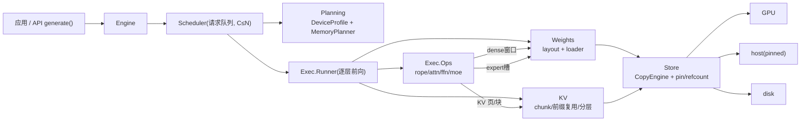
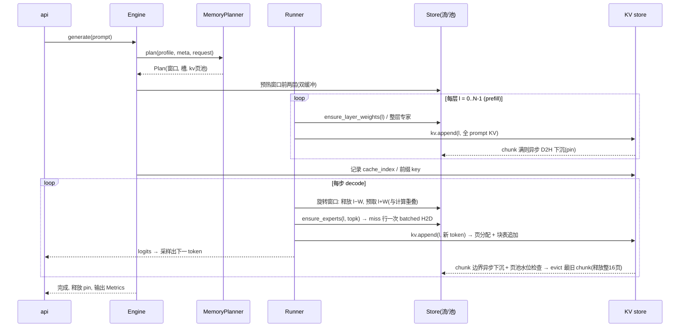

# PlasticInfer 综合设计方案

版本：v0.1（评审稿）
范围：消费级单卡（8–16 GB VRAM）+ 主机内存 + NVMe，低并发；模型覆盖稠密（Llama 系）+ 经典 MoE（Mixtral 式）。
交付：仅本设计文档。

PlasticInfer 是一台把「GPU 显存、CPU 内存、磁盘」当三种容量、三种带宽来用的弹性推理内核。目标不是把所有张量塞进显存，而是让「每步真正参与计算的张量」在正确的时间出现在正确的一层，并让搬移与计算重叠，让值得复用的结果留在热层。

---

## 1. 目标与非目标

### 1.1 目标场景

在一台典型设备上跑「装不下的模型」：

- GPU 8–16 GB，主机内存 32–64 GB，NVMe（顺序读 2–7 GB/s），PCIe 3.0/4.0。
- 稠密模型：Llama-3.1-70B 级（一次推理跑通，吞吐优先）。
- 经典 MoE：Mixtral-8x7B / Qwen3 30B-A3B 级（权重全部常驻主机内存，专家稀疏取用）。
- 单请求或极少数并发（先 C=1），多轮对话有共享前缀 → KV 前缀复用有意义。

### 1.2 非目标（第一版明确不做，避免过度设计）

- 不做多机/多卡、不做训练与微调、不做投机解码。
- 不做 vLLM 式连续批处理与 radix 前缀树调度；KV 在本机做轻量页式管理（活跃请求一条线性 block table + 全局页 free-list），前缀复用靠 chunk 索引，不做跨请求的页级子树共享。调度仍只到「请求级重规划」。
- 不做 decode 阶段的「路由预测 / 代理网络」（FreeToken 证明其不存在且非必需，见 §2）。
- 不做 KV 在线量化压缩（保留为后续可选，见 §5.5）。
- 不做 CUDA Graph 捕获（FreeToken 为此付出巨大复杂度；v1 用显式 stream + 事件，正确优先）。
- 不做「运行时 disk↔RAM 逐 token 换页 KV」（host 只做长期序列的流式注意力，disk 只做跨请求持久化，见 §5.5）。

---

## 2. 三个参考实现的关键结论

三个项目分别回答一种「装不下」。读源码后的结论浓缩如下，每条对应后面的一个设计决定（标注 D#）。

| 项目 | 一句话机制 | 直接借鉴（→ 设计点） | 明确不抄（→ 理由） |
|---|---|---|---|
| **AirLLM** | meta 空壳 + 逐模块 forward hook：模块要执行前把该层权重 disk→GPU，执行后立刻释放 | 每层一个权重文件、按前缀切分、passthrough 硬链；per-expert 用 safetensors 按张量 seek 做子读取；超大表 mmap + CPU 行查找 | 每 token 全模型整盘重读且无重叠（D2）；每层 `empty_cache` 摧毁 allocator（D2/D7）；同步 `.to(cuda)` 无 copy/compute 流水（D4）；依赖 HF hook 与 `__class__` patch 的脆弱集成 |
| **FreeToken** | 专家权重常驻 host RAM（bank），GPU 上只留 LRU 槽缓存子集；prefill 用整层双缓冲（lookahead=1 层），decode 按需取缺行；不做路由预测 | host bank + GPU 槽缓存的分离（D3）；prefill「不猜路由、整层双缓冲、miss 走一次 batched copy、hit 走 D2D」（D6）；带宽匹配的 CPU 溢出 hybrid（后置，D8）；设备端 LRU + 定形 launch 保 CUDA-graph 安全（v1 不抄 graph，但保留「准入/淘汰做成纯设备值」的思路，D5） | 显存放得下「2×整层专家」的前提（每层 > 半卡显存即退化）；运行时从不读盘的 host-only 假设（我们多了 disk 层）；与私有 flashlib / tvm-ffi 深度耦合；预算求解硬编码「KV 页 + MoE 槽」两种货币（我们把它做成可测的三池规划，D1） |
| **LMCache** | 引擎 forward 期间把新产出的 KV 从页式 buffer「影子拷贝」成 256-token chunk，异步下沉 CPU(L1)→盘/远端(L2)；新请求用链式前缀 hash 命中复用 | chunk 化 + 链式前缀 hash（确定性、非 builtin）（D9）；影子拷贝下沉与逐层计算流水化（save/load 挂 forward 内）（D6/D7）；拷贝期 refcount/touch 保护、驱逐只回收未 pin 对象（D7）；「命中前缀只加载连续部分、其余增量 prefill」（D10）；逐层流水 save_kv_layer / wait_for_layer_load（D6） | chunk(256)与引擎块(16) hash 域脱节、无法继承引擎已算 hash、前缀需外部对齐（我们自持 KV：块=16 token 是引擎自有分配单元，chunk=16 块且边界与块对齐，单一 hash 域，D9）；按 vLLM 小版本 fork 3 份 connector（脆弱）；in-process 与 MP 两套存储并存、概念重名（v1 只有进程内一套） |

关键洞见汇总：

- **D2：decode 的瓶颈是「每 token 把不驻留的权重重读一遍」，不是算力。** 一切优化围绕减少每步重读字节数（驻留窗口、RAM 缓存、稀疏加载、量化）和让必须发生的搬移与计算重叠。
- **D3：按访问模式分三类数据、三套策略**（顺序权重 / 稀疏专家 / KV），而不是把它们塞进同一个「万能缓存」抽象。三者共享搬移与 pin 内核，但生命周期、粒度、驻留策略各不相同（KV 在块级页化之上按 chunk 管理）。
- **D4：AirLLM 最痛的是同步搬移无重叠。** 我们显式引入流（stream）+ 双缓冲 + 事件，把「计算上一层的同时搬下一层」做成引擎默认。
- **D5：正确的数值与「张量放哪一层」无关。** 引擎只搬数据不改数值，因此可以拿「与参考前向逐 token 等价」作为总测试锚点（§7）。
- **D6：能被重叠掩盖的搬移，才值得为其做预取。** prefill 算得多 → 整层预取划算；单请求 decode 每层算得少、取数在依赖链上排在同层 GEMM 前 → 预取无收益，靠 LRU 命中摊薄（FreeToken 的诚实结论）。
- **D7：驱逐永远只能回收「无在途引用」的对象。** 拷贝未完成的对象必须 pin 住，这是三层存储唯一的硬性安全不变量。
- **D8：真正的跨带宽重叠 = hybrid。** 让 PCIe 取数和 CPU 溢出计算按实测带宽比例分摊、同刻收尾。v1 作为专家缓存 miss 时的可选降级，不默认。
- **D9：内容寻址必须确定性与跨请求可复算。** KV chunk key 由 token 内容（sha256 级链式 hash）得出，绝不依赖进程内 id 或 builtin hash。
- **D10：前缀命中后只计算没命中的尾部。** 命中段从热层回灌 GPU，引擎只对尾部增量 prefill。

---

## 3. 三类数据的访问模式 → 三种策略

### 3.1 数据分类

| 类别 | 例子 | 访问模式 | 关键性质 |
|---|---|---|---|
| 顺序权重（dense） | 注意力/范数/稠密 FFN 权重；稠密模型的全部权重 | 每个 decode 步都从 layer 0 扫到 N；同一层跨步稳定复用 | 步间时间局部性强，但每步全都要用到 → 收益来自「GPU 驻留窗口 + RAM 缓存」与流水重叠 |
| 稀疏专家 | MoE 每层每专家一行权重 | 每步每 token 只路由 top-k 个 | 一次只用很小比例 → 收益来自「sparse load：按路由加载，而非整层」+ LRU 槽 |
| KV cache | 每 token 每层 K/V | 写入：顺序追加（按页分配）；读取：后续 token 全量读前缀；跨请求：共享前缀复用 | 写一次读多次、可持久化复用 → 收益来自「按页分配 + chunk 下沉 + 前缀复用」，长序列时来自 host 流式注意力 |

### 3.2 资源与带宽模型

运行前探测并缓存一次（`DeviceProfile`）：

- `hbm`：GPU 显存总量与基准空闲量。
- `b_h2d`：实测 PCIe host→device 有效带宽（约峰值 0.5–0.7，可用一个拷贝内核测）。
- `b_host`：主机内存读带宽（单/双通道不同，用于 CPU 溢出与 KV 流式）。
- `b_disk`：NVMe 顺序读带宽（大文件 + 预读）。
- `pin_limit`：可 pin 的主机内存上限（WSL/WDDM 下约为 RAM 一半，FreeToken 有成熟探测法）。

记每类数据的字节：

- `B_d`：顺序权重总字节（fp16/bf16 按需；quant 时按页折算）。
- `b_e(l)`：层 l 单个专家的行字节；`B_e(l)=E_l·b_e(l)`。
- `kv_tok(l)`：层 l 每 token 的 K/V 字节（GQA 下 `2·n_kv_heads·head_dim·dtype`）。
- 每层 dense 权重字节 `W_d(l)`。

**decode 每步的下界**（单请求）：

```
每步搬移时间 ≥ max(必须从最慢层读回的字节) / 该层带宽
    + 专家 miss 期望字节 / b_h2d
    + KV 驻留页不足时的回灌字节 / b_h2d
```

当 GPU 驻留窗口为 `W` 层时，每步顺序权重搬移 ≈ `(N − W)·max(W_d)/b_src`，其中 `b_src` 是权重源层带宽：host 命中 ≈ `b_h2d`，host 缺失走 disk ≈ `b_disk`。AirLLM 相当于 `W=1`、源=disk、且搬移同步不重叠——这是我们的改进基线（§3.5）。

### 3.3 驻留预算规划（MemoryPlanner，纯算术、可单测）

三类数据各自一个**独立预算池**，池的上限之和 ≤ `hbm × (1 − safety)`（safety 默认 0.08，留给 kernel/allocator 抖动）。独立池避免一类数据吃光另一类（LMCache 的多桶教训），也让请求级重规划只动一个池。

贪心优先级（默认）：

1. 激活与计算暂存：按「最大单层中间张量 + 全长 hidden state」估算（bs 低，量小），保留固定余量。
2. KV 页池：`kv_hot_tokens = min(请求序列预算, 剩余 / kv_tok)`，换算成页（默认一页 16 token）。KV 在 GPU 上按页按需分配，不按请求长度预占；某 chunk（16 页）在 GPU 驻留与否是缓存决策：刚算出的尾部与「前缀装载进来的命中段」驻留，其余下沉（§5.5）。
3. 专家槽池：在显存允许时优先给足——稀疏是单位显存收益最大的策略。默认 `expert_slots = clamp(total_experts, E_floor, min(E, 预算/b_e))`。FreeToken 默认 `E_floor = 2×E_l`（prefill 双缓冲）或 `E_l`，我们同样让 prefill 双缓冲复用槽池前段（§5.2）。预算不足时退 hybrid/CPU 溢出，不静默 OOM。
4. 剩余全部给顺序权重的 GPU 驻留窗口 `W = floor(剩余 / mean(W_d(l)))`；`W ≥ 2`（双缓冲底线，D4）否则提示该模型在此卡上只能退化为低吞吐流式模式（诚实暴露，不隐藏）。

规划输出 `Plan`（dataclass）：`resident_layers`（窗口）、`expert_slots_per_pool`、`kv_hot_tokens`、`seq_weight_source ∈ {HOST, DISK, HOST_FIRST}`、`long_ctx_mode ∈ {GPU, HOST_STREAM, REJECT}`、各类 dtype。**不变量：池上限之和 ≤ hbm×safety 逆。**

### 3.4 「弹性」的确切含义

不在毫秒级做动态迁移，而是在**请求边界与阶段边界**上重规划：

- 每个新请求开始前：用请求属性（长度预估、目标模型）重新调用 `MemoryPlanner.plan`，在空闲处切换 KV 页池 / 专家槽 / dense 窗口的份额（FreeToken 的空闲期 `rebuild_cache` 思路，但我们只重规划不重捕图）。
- prefill → decode 边界：确定窗口起点、预热前两层权重。
- KV 页池满 / 前缀命中加载：触发该池内的 evict + 下沉，不碰其它池。

低频、可预测、每步一次，这就是「弹性」的全部机制——不需要通用调度器。

### 3.5 与 AirLLM 基线的收益来源（定性，未 benchmark）

| 机制 | 消除的浪费 |
|---|---|
| 顺序权重驻留窗口 W>1 + 双缓冲流水（D4） | AirLLM 每步重读 `N` 层且不重叠 → 只读 `N−W` 层且搬移藏在计算后 |
| 权重源 host-first（RAM 命中） | 把每步源从 disk（2–7 GB/s）提到 host（近 PCIe，20–30 GB/s） |
| 专家 sparse load + LRU（D3） | MoE 从「整层流式」降到「top-k 行 + 高命中率补取」 |
| KV chunk 下沉 + 前缀复用（D9/D10） | 重复前缀不再重跑 prefill |
| 每层不再 `empty_cache`（D2） | allocator 复用不被打断 |

诚实上限：稠密 70B 且 RAM 也放不下时，每步仍要从 disk 重读大部分权重，吞吐以 s/token 计——这是物理约束，不是缺陷。PlasticInfer 保证的是「在此约束下做到最优重叠与最少重读」，并在 MoE / 短序列稠密场景给出可用吞吐。

---

## 4. 总体架构

### 4.1 模块图



### 4.2 模块清单（职责一句话）

| 包 | 模块 | 一句话职责 |
|---|---|---|
| `planning` | `profile.py` | 探测/缓存带宽与容量 |
| | `budget.py` | 纯算术：模型+请求 → 驻留 `Plan`（三池分配） |
| `store` | `tiers.py` | 三层 Tier 枚举与带宽/成本表 |
| | `mover.py` | 异步 CopyEngine：按流搬移、双缓冲 ring、事件同步 |
| | `resident.py` | pin/refcount、可逐出判定、LRU 池（供三个池实例化） |
| `weights` | `layout.py` | 每层/每专家磁盘布局与字节偏移索引（纯逻辑） |
| | `loader.py` | 按 Plan 把权重 disk→host→GPU，带预取 |
| `kv` | `chunk.py` | chunk 划分、链式前缀 hash、前缀匹配（纯逻辑） |
| | `paged.py` | 页分配器（全局 free-list）+ block table：按页分配/回收逻辑 KV 页 |
| | `kv_store.py` | 逐层 KV 写读、页分配、影子下沉、前缀装载 |
| | `attention.py` | 分页注意力（块表寻址）；可选 host 流式长序列注意力 |
| `exec` | `ops.py` | RoPE / MHA-GQA / FFN / expert GEMM / top-k 路由（薄算子） |
| | `runner.py` | 逐层 prefill/decode 执行，串起 weights/kv/store |
| `runtime` | `engine.py` | 编排：plan → prefill → loop → replan |
| | `scheduler.py` | 低并发请求队列与批选择（先 C=1） |
| | `api.py` | `generate`/`stream`，复用 HF tokenizer 与采样参数 |

依赖方向单向：`runtime → exec → {weights, kv} → store → tiers`，`planning` 只被 `runtime` 引用。`weights` 与 `kv` 互不依赖（都只依赖 `store`），保证可各自独立单测。

### 4.3 线程与流模型

单个推理进程，三类并发源：

1. **GPU 计算流 `S_main`**：跑 prefill/decode 的所有算子，唯一「消费张量」的流。
2. **搬运流 `S_copy`**：权重 H2D、专家取行、KV 影子 D2H / 前缀回灌 H2D。所有与计算重叠的搬移都在这条流上排队；用事件与 `S_main` 对齐（compute 等 ready、copy 等 buffer 释放）。
3. **I/O 后台线程（1–2 个）**：disk→host 的读入（AirLLM 的单 worker 思路，深度可配为 2）。读入目标是 host 层，天然不与 GPU 争流，只争带宽。

不变量：**同一份 buffer 同一时刻至多一个 writer/reader 且被 pin**；`S_main` 永远不直接发起长搬移（D4）。背景线程与 GPU 流之间的同步只通过「任务 + 事件」，不共享可变张量。

---

## 5. 模块设计

### 5.1 planning

**职责**：回答「这个请求在这个设备上，怎么分显存、源层在哪、KV 能开多长」。

```python
@dataclass(frozen=True)
class DeviceProfile:
    hbm: int; pin_limit: int
    b_h2d: float; b_host: float; b_disk: float
    # bytes/sec; 由 profile.probe() 实测

@dataclass(frozen=True)
class ModelMeta:
    n_layers: int; dense_bytes: int          # B_d
    per_layer_dense: tuple[int, ...]          # W_d(l)
    experts_per_layer: tuple[int, ...]        # E_l
    expert_row_bytes: tuple[int, ...]         # b_e(l)
    kv_bytes_per_token: int                   # Σ kv_tok(l)

@dataclass(frozen=True)
class RequestMeta:
    seq_budget: int        # 模型支持上限
    gen_tokens: int        # max_new_tokens 预估
    reuse_prefix_chunks: int  # 该请求能命中的历史前缀 chunk 数(可为 0)

@dataclass(frozen=True)
class Plan:
    weight_window: int           # W
    seq_weight_source: str       # HOST | DISK | HOST_FIRST
    expert_slots: int
    kv_hot_tokens: int
    kv_host_overflow: bool  # KV 是否允许占满 host L1 页池并逐出到 disk 层(真流式长上下文)
    long_ctx_mode: str           # GPU | HOST_STREAM | REJECT

class MemoryPlanner:
    def plan(self, p: DeviceProfile, m: ModelMeta, r: RequestMeta,
             *, safety: float = 0.08, kv_reserve_tokens: int = 2048) -> Plan: ...
```

**不变量**（单测断言对象）：

- `Σ 池上限 ≤ hbm·(1−safety)`；任何分支（专家超预算、KV 超出页池预算、dense 放不下）都必须产出 Plan 或显式 `REJECT`，不静默超卖。
- `weight_window ≥ 2` 或显式降级标志；`expert_slots ≤ ΣE_l` 且为预算所允许的贪心最优值。

**为什么这样**：所有决策参数化成 `Profile×Meta×Request → Plan` 的纯函数，避开「运行时不知道显存够不够」的试探（FreeToken 预算 `assert` 而非 OOM 的思路，但做成可测模块）。

### 5.2 store

**职责**：唯一的异步搬移与驻留管理内核，供顺序权重窗口、专家槽、KV chunk 驻留（页）三个池复用。

```python
class CopyEngine:                      # mover.py
    # 单后台线程 + 每目标 Tier 一条搬移流，实际使用方显式传 stream/event
    def h2d(self, dst_view, src_host, stream, when: Event|None) -> Handle: ...
    def d2h(self, dst_host, src_gpu, stream, when: Event|None) -> Handle: ...
    def wait(self, h: Handle): ...     # 边界处同步

class Page:                            # resident.py  一个可驻留对象
    key: tuple                      # ("dense",l) / ("expert",l,eid) / ("kv",chunk_key)
    bytes_: int
    tier: Tier                      # GPU | HOST | DISK
    pinned: bool                     # 有在途拷贝/正在被计算引用时置 True

class LruPool:                       # resident.py  按预算上限的通用池
    def __init__(self, budget_bytes: int): ...
    def pin(self, key) -> Page: ...      # 引用计数+1
    def unpin(self, key) -> None: ...
    def evict_lru(self) -> list[Page]:   # 只回收 pinned=False 且 tier==GPU 的
    def fit(self, key) -> bool:          # 预算内能否放入
```

三个池各自一个实例，各带独立预算（§3.3）：

- **dense 窗口池**：默认策略为「旋转驻留」，由 runner 直接驱动，不需要 LRU 淘汰竞争（每步每个窗口层都用到；换层只在重规划时发生，此时整池同步换）。
- **专家槽池**：decode 时按路由命中/淘汰，LRU 语义（FreeToken 的设备端 LRU 在本模块由 host 侧 LRU + 一次 batched H2D 代替，v1 不做 CUDA Graph；若以后上 Graph，把准入/淘汰改回纯设备值内核，接口不变）。
- **KV 页池**：页 free-list + chunk 级 LRU 决定驻留；逐出 = 释放该 chunk 的全部页（每层 16 页，见 §5.5）进 free-list（数据已有 host/disk 副本）。

**硬性安全不变量（§3-D7，全引擎唯一真正的锁规则）**：

> 驱逐只能回收 `pinned == False` 的对象；pin 发生在「决定搬移 / 开始被计算引用」之前，unpin 发生在搬移完成事件之后。池满时若全部对象都被 pin，宁可阻塞等待，也不动在途数据。

**为什么这样**：AirLLM 每层 `empty_cache`、FreeToken 把淘汰逻辑埋在设备核里、LMCache 用跨进程锁 + eventfd——对单进程 v1，一份 refcount + 事件就够（LMCache 报告自己也承认单机不该上重型锁协议）。双缓冲 = 窗口池里 `W+1` 个 ring 槽，不是额外抽象。

### 5.3 weights

**职责**：把 HF 权重变成「按需可按层/按专家取字节」的布局，并按 Plan 喂给执行端。

**layout.py（纯逻辑）**

- 落盘格式沿用 AirLLM 的结论：**一个 safetensors 文件 = 一个流式单元**。dense 模型 = 每层一个文件（`model.layers.0.safetensors` …）；MoE = 每层文件内专家按 `experts.<i>.*` 前缀分别索引。
- 生成 `index.json`：`层号 → (文件路径, 张量字节偏移)` 与 `专家行 → (层号, 文件偏移, 行字节)`。**专家按张量 seek 子读取**，使「稀疏加载」的 I/O 随实际路由走而非整层（AirLLM 的 per-expert `load_layer_subset` 思路）。
- 转换期优化：若 HF checkpoint 已天然一层一文件，用硬链 passthrough，不重写（AirLLM 对 ~TB 级模型的必需项）。
- 超常驻大表（如巨型 embedding）：从流式单元中剥出，mmap + CPU 行查找，永不进 GPU。

**loader.py**

- 阶段化加载：`disk → host`（后台线程，深度可配，O_DIRECT 顺序读）→ `host → GPU`（`S_copy` 流）。只把需要 pin 的 host 缓冲 pin，超 pin 限额的层保持 pageable 且自动降级其流水（FreeToken split-residency 的思路）。
- 按 Plan 的 `seq_weight_source` 决定 host 是否常驻整份（`HOST`）还是只留窗口缓冲 + disk 兜底（`DISK`/`HOST_FIRST`）。

**正确性**：搬移永远不改数值；仅当开启页级量化（后续项）才在 disk 层做一次有损转换，且执行端看到的是反量化后的精度。

### 5.4 exec

**职责**：自研轻量前向。不 hook HF，不复用 HF 运行时（范围决定），但**模型元数据与权重来自 HF 权重/分词器**。

**ops.py**：薄算子集，只实现经典 MoE 与 Llama 系需要的原语。

- RoPE（可 fused 或预计算表）、RMSNorm。
- MHA/GQA 注意力：输入是「块表 + 页式 K/V 布局」而非连续张量。v1 默认后端 = 按块表把当前需读的驻留页 gather 成连续 K/V 再走 `torch.nn.functional.scaled_dot_product_attention`（正确优先，SDPA 不可用时退 eager）；预留真分页注意力内核接口（FlashInfer / vLLM paged-attention / 自研 triton），后续替换不改接口。
- FFN（稠密路径）：一次 GEMM 完成，无中间落盘。
- MoE 路径：`top-k 路由 → 按槽位聚束 → grouped GEMM`。v1 实现取「可验证优先」：路由把 (token, expert) 映射为每专家的小批量，`index_select` 后做 `[E, b_e]×[E,I,H]` 的 batched matmul；性能优化（triton grouped GEMM、fused up/gate）后置，接口不变。
- **数值锚点**：每个 op 配一个「逐元素 loop 参考实现」作单测对拍。

**runner.py**

- 逐层执行，串起三件事：当前层 dense 权重（窗口池/流式）、MoE 层当前 token 的路由专家（槽池）、当前 token 的 KV 写（页池 + block table）。
- prefill 与 decode 两套循环；与 store 的对接点只有四个：`ensure_layer_weights(l)`、`ensure_experts(l, topk)`、`kv.append(l, token_kv)`（内部按页分配并维护 block table）、`kv.load_prefix(chunks)`（先为命中段分配页、建表、回灌，再增量 prefill）。

**prefill 流水（D6 的具体化）**：MoE 层不猜路由 → 整层双缓冲（复用槽池前 `2·E` 槽），算层 l 时把 l+1 整层专家拷上 GPU（hit 走 D2D，miss 走一次 batched copy），与层内 GEMM 重叠。dense 层同理，逐层 prefetch 下两层。**这就是 AirLLM 缺、FreeToken 有的那层重叠。**

**decode 循环**：单步内依赖链（router(L) 依赖 attention(L) 依赖 MoE(L−1)）决定专家取数排在同层 GEMM 前、无法用同层计算掩盖 → 不硬做「下一步专家预测」，靠槽池 LRU 命中把 miss 摊薄（D6/D8）。CPU 溢出 hybrid 作为可选降级：当槽池 miss 频率高且 `b_h2d` 与 `b_host` 已知时，按 `fetched : cpu_miss = b_h2d : (b_host − b_h2d)` 分摊，让两端同刻收尾（FreeToken 公式）。

### 5.5 kv

**职责**：KV 的三层生命周期 + 跨请求前缀复用。**KV 在 GPU 上是页式的**。KV 下沉 CPU、跨请求前缀复用能省显存的根源是「GPU 侧 KV 区是一块缓存，不是每个请求预留的一段」：不页化就只能按请求最大长度预占整段连续显存（浪费），也无法把中间的旧 chunk 独立逐出（逐出必须按块回收、由 block table 改映射）。页化把「驻留哪些 chunk」变成可逐出决策，这正是 CPU 卸载与前缀复用的前提。

**paged.py（页式组织，分配/寻址的最小单位）**

- 页（block）：默认 16 token × 一层全部 kv head 的 K/V，张量排布 `[num_pages, n_kv_heads, head_dim, page_size]`（vLLM 式）。一页是 GPU 上分配、异步搬移、kernel 寻址的最小单位。
- 活跃请求持一条 `block table`：`(layer, 逻辑 token 段) → 物理页 id`。C=1 下它是「随 decode 追加的线性表 + 前缀装载补的表项」，**不需要 radix 树和页级子树引用计数**。
- 页分配器：全局 free-list + 高水位记账。页粒度分配、可独立回收，请求结束全部页进 free-list 供下个请求直接复用——短请求与高复用请求只占实际页数，不再按最大长度预占。

**chunk.py（纯逻辑，与页严格对齐）**

- chunk = 256 token 在**全部层**上的 KV，物理上每层 16 页（页 = 16 token），一个 chunk 共 `L × 16` 页。**chunk 边界与页边界对齐**：下沉/回灌一个 chunk = 归还或补填它在每层的 16 页 + 块表增删表项，无半页搬移。单一 hash 域，无 LMCache「缓存 chunk 256 vs 引擎块 16 两套 hash」的分裂（D9）。
- `ChunkKey = sha256 级链式 hash(prev_key, tokens[i:i+C])`，起始固定盐；用 torch int64 token 流计算，绝不依赖 builtin hash / 进程内 id。
- `longest_prefix_hits(cache_index, tokens) -> (matched_chunks, tail_span)`：返回能整体命中的最长 chunk 前缀 + 未命中尾段；只匹配整 chunk，缺口之后一律不搬（prefix-only，D10），非整 chunk 请求显式报错。

**kv_store.py**

- 写：decode 每步 `append(l, token_kv)` → 从 free-list 分配/续用一页、写入、追加 block table。各层同步推进，token 位置到 chunk 边界（每层该位置满 16 页）后在 `S_copy` 上把整 chunk（每层 16 页）异步影子下沉到 host L1（pin 到拷贝完成；D2 重叠），副本与计算解耦，页可随后独立逐出。
- 驻留决策（chunk 维度 LRU + 请求活跃性）：刚算出的尾部 chunk、前缀装载进来的命中 chunk 驻留 GPU；最旧且非活跃的 chunk 逐出 = 释放其全部页（每层 16 页）进 free-list（数据已下沉，页安全复用）。
- 前缀装载：`longest_prefix_hits` 命中 N 个 chunk → 为命中段分配页、建 block table、从 host/disk 异步回灌，引擎只对尾段增量 prefill（D10），装载完成事件后才允许注意力读取该段。
- 溢出：GPU 页池不足且序列需继续 → 逐出最旧 chunk；host L1 超上限 → 持久化到 disk（可配关）。**live decode 注意力只读「GPU 驻留页 + host 中温块」，disk 只做跨请求持久化与命中回灌**（逐 token 盘交换在带宽上是灾难）。

**attention.py**

- 分页注意力：读驻留页（§5.4 的 gather 或真分页 kernel 后端）。
- 长序列 `HOST_STREAM`（可选、默认关）：KV 超出页池后，把 host 上的旧 chunk 按块拷入一块固定 GPU 暂存，做闪式 softmax 增量。代价 = 每步重读全部 host KV，只在 host 带宽能接受的长度内开启；默认超长即 `REJECT`，不静默降质。

**不做**：不做 vLLM 式 radix 前缀树 / 页级跨请求子树共享（C=1 用线性 block table + chunk 索引足够）；KV 量化压缩（fp8 serde）列为后续项；不做跨进程/跨机共享。

### 5.6 runtime

**engine.py**

- 持有：`DeviceProfile`、一个 `MemoryPlanner`、模型 `layout`、三个池、`runner`、`kv_store`。
- `Engine.generate(model_id, prompt_tokens, params)` 主循环：
  1. `plan = planner.plan(profile, meta, request)`；必要时 `replan()`（换份额、换窗口、换源层）。
  2. `prefill(prompt, plan)`：整层流水跑一遍，产出 KV 并开始影子下沉；记录该 prompt 的 chunk key 进 `cache_index`。
  3. `decode loop`：每步 `ensure 窗口/专家 → 算子 → kv.append → 采样 → 收集 KV chunk 下沉`；检测页池水位，触发最旧 chunk evict（释放其每层 16 页进 free-list）。
  4. 结束时释放 pin、落盘可持久 chunk、打印 Metrics（每阶段搬移字节/带宽、专家命中率、KV 命中 chunk 数）。

**scheduler.py**：先只做 C=1：一个活跃请求 + FIFO 队列；重规划只在队列空转与请求边界发生。C>1 的微批 decode 预留 `BatchSpec` 接口但不实现（不设计不存在的并行）。

**api.py**：`generate/stream/chat`；tokenizer 与采样复用 transformers（引擎只保证 logits 等价，采样交给标准 sampler，便于对拍）。

---

## 6. 一次请求的执行流程



多轮对话的第二轮：`prefill` 前 `longest_prefix_hits` 命中首轮前缀 → 直接跳过硬 prefetch 那一段，只增量算新问句（§5.5 前缀装载）。

---

## 7. 单元测试策略

**总原则**：

- 每个模块的测试断言「不变量」而非「实现细节」；测试不依赖 GPU 的跑在 CPU（默认），GPU 相关的用 `@pytest.mark.gpu` 隔离。设备差异收敛到 `store.tiers` 的抽象上，因此 CPU 单测用「host 当 device / disk 当 host」来模拟三层，不改被测代码。
- 纯逻辑模块（planning、weights.layout、kv.chunk）承担最重的测试：无环境依赖、速度快、边界好构造。
- 每个模块只测它的「意义明确」的属性，不重复测它依赖的模块。

| 模块 | 测试文件 | 断言的核心性质（每个性质一条用例族） |
|---|---|---|
| planning.budget | `test_budget.py` | 三池和 ≤ hbm·(1−safety)（property test 随机 Profile×Meta）；专家/窗口/KV 各极端（专家超预算→槽=全量+提示；dense 塞不下→窗口=2+降级标志；KV 超出页池→溢出模式选择） |
| store.tiers/mover | `test_mover.py`（CPU 模拟） | 双缓冲 ring 不重叠写同一槽；事件顺序（compute 等 ready / copy 等 release）；同一份 buffer 无并发写 |
| store.resident | `test_resident.py` | pin 对象不可被 evict；池满且全 pin 时阻塞而非误逐出；LRU 只回收 `pinned=False` 且 tier==GPU |
| weights.layout | `test_layout.py` | 层/专家字节偏移索引与合成 manifest 一致；专家子读取偏移=头指针+行字节×eid；passthrough 判定 |
| kv.chunk | `test_chunk.py` | 链式 hash 确定性 + 跨 token 复用 key 相等；最长前缀命中返回正确 (matched, tail)；非整 chunk 对齐报错；不同 prompt 同前缀不同后缀 key 区分 |
| kv.paged | `test_paged.py` | free-list 分配/回收不重复、无泄漏；任意顺序分配释放只产生 ≤1 页内部碎片；block table 一致（追加/装载/逐出后 token→页 映射正确）；跨请求页复用；逐出 = 整 chunk 页回 free-list |
| kv.kv_store | `test_kv_store.py`（伪 store） | chunk 写读回环一致；下沉只发生在 pin 完成事件后；前缀装载 = 分配页 + 建表 + 只搬命中段；页池水位触发 evict 最旧 chunk（每层 16 页回 free-list） |
| exec.ops | `test_ops.py` | 每个 op 与逐元素 loop 参考实现对拍（rope/attn/moe route+gemm），随机形状+随机权重，CPU |
| weights.loader | `test_loader.py` | host-first vs disk 源加载结果逐字节一致（加载是纯搬移） |
| exec.runner | `test_equiv_smoke.py`（集成） | 极小 dense/MoE 模型（可 CPU 跑通，如 ~100M 级或合成 config）整个 prefill+几步 decode 的 logits 与 transformers 参考逐 token 等价（同一权重、同采样种子） |

**不冗余的具体含义**：runner 的集成测试是「总账」——它通过、模块单测就只查各自的局部不变量，不重复整链；budget 与 chunk 是纯函数，不因 store 内部实现改动而重写。任何「把数据从 A 层搬到 B 层」的功能都要求（1）搬移结果逐字节一致（单测）、（2）搬移时机遵守 pin/事件（单测）、（3）整链数值等价（集成），三条缺一即失败，但互不重复。

**代码风格约定**：纯函数与 dataclass 优先；副作用（流/事件/线程/IO）只存在于 store 与 loader 底层；每模块顶层 docstring 一句职责；不写用不到的配置项。

---

## 8. 实施里程碑（PoC 顺序）

每个里程碑的 gate 都是「对应单测全绿 + 可端到端跑通」，不进入下一步。

- **M0 骨架 + 稠密流水**：planning/store/weights 落地；任意稠密小模型（1B 级）在「host 常驻 + 窗口流式 + 双缓冲」下与 HF 逐 token 等价（CPU 可跑）。Gate：test_budget/test_mover/test_resident/test_layout/test_equiv_smoke 绿。
- **M1 经典 MoE 卸载**：Mixtral 8x7B 级；host bank + 专家槽 LRU + prefill 整层双缓冲。Gate：test_ops/test_equiv_smoke(MoE) 绿 + 真卡上 decode 专家命中率可观测。
- **M2 KV 分层与前缀复用**：chunk/影子下沉/前缀命中增量 prefill；多轮对话第二轮跳过重跑。Gate：test_chunk/test_kv_store 绿 + 两轮对话 KV 命中指标可见。
- **M3 disk 权重层 + 弹性重规划**：`DISK`/`HOST_FIRST` 源、请求级份额切换、长序列 `HOST_STREAM`（可选开关）。Gate：全部 CPU 单测 + GPU 冒烟。
- **M4 性能工程（不在范围主线）**：量化解码、grouped GEMM、CUDA Graph 捕获——每项以可重复 benchmark 决定要不要。

---

## 9. 刻意不做（防过度设计清单）

- 不写统一的「三用万能缓存」：dense 窗口、专家槽、KV chunk 复用同一 pin/refcount 内核，但各有生命周期语义（KV 在其上再套页 free-list，见 §5.5）。
- 不为 decode 发明专家预测器（FreeToken 从源码层面证明它不存在也非必需）。
- 不做 vLLM 式 radix 前缀树与页级跨请求子树共享：C=1 下线性 block table + chunk 索引已覆盖前缀复用；页化纳入，但调度复杂度不跟进。
- 不实现不存在的并发：C=1 时没有批调度；C>1 的接口只留缝。
- 不引第三方调度/锁（flashlib、vLLM connector）：搬移/驻留是自家 ~200 行可替换内核。
- 不在 v1 引入 KV 压缩、CUDA Graph、跨进程共享——都以「Plan 级开关 / 后续项」标注而非预留架构洞。
- 每个模块如果无法用一句话说清职责，说明它不该存在。

---

## 附：术语

- 顺序权重（dense 权重）：每步 decode 都要用到的整层权重（注意力/范数/稠密 FFN），访问是「顺序全扫」。
- 稀疏专家：MoE 中按路由访问的每层每专家权重，访问是「top-k 随机」。
- KV 驻留区 / L1(host) / L2(disk)：KV 三层；驻留区 = 当前在 GPU 上驻留的 KV 页/chunk（活跃请求正在读写的部分），L1 = 主机内存中温，L2 = 磁盘持久。
- 页（block）：GPU 上 KV 分配与寻址的最小单位（默认 16 token × 一层全部 kv head）；按页按需分配，不按请求长度预留整段。
- block table：活跃请求「(层, token 段) → 物理页」的映射；追加 / 前缀装载 / 逐出只改表项与页分配。
- chunk：缓存与复用单元，= 每层 16 页 = 256 token（跨全部层），与页边界严格对齐；下沉/回灌按整 chunk 进行。
- 影子下沉：在 GPU 上产出 KV/权重后，异步复制一份到低层，副本可自由逐出而不影响计算。
- 窗口（weight window）：GPU 上驻留的连续层数 W；decode 时随层号旋转。
